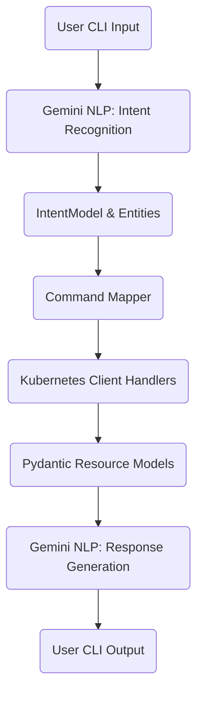

# kubeai Architecture & Extensibility

## Overview

**kubeai** is a modular, extensible Python CLI tool that enables natural language-driven Kubernetes operations. It combines:
- **Google Gemini** for NLP (intent/entity extraction and summarization)
- **Pydantic models** for structured, validated data
- **Kubernetes Python client** for cluster operations

The design emphasizes clear separation of concerns, robust validation, and ease of extension for new resource types and actions.

---

## High-Level Architecture



### Component Breakdown

- **CLI (app.py):**
  - Accepts user queries
  - Orchestrates the NLP, command execution, and response flow

- **NLP Core (nlp_core.py):**
  - Uses Gemini to parse user input into structured intents/entities
  - Generates natural language summaries from structured data

- **Models (models.py):**
  - Pydantic models for intents, entities, and Kubernetes resources (e.g., PodStatusModel)
  - Ensures all data is validated and structured

- **Kubernetes Client (k8s_client.py):**
  - Loads kubeconfig or in-cluster config
  - Maps intents to handler functions
  - Executes Kubernetes API calls and parses results into models

- **Command Mapping:**
  - Dictionary mapping intent names (e.g., 'get_pod_status') to handler functions
  - Each handler extracts parameters, calls the API, and returns validated models

- **Tests (tests/):**
  - Unit and integration tests for all major components

---

## NLP Flow

1. **User Query:**
   - e.g., "Show me pods in kube-system"
2. **Intent Recognition:**
   - Gemini returns: `{ intent: 'get_pod_status', entities: [{type: 'namespace', value: 'kube-system'}] }`
3. **Command Execution:**
   - Command mapper routes to the correct handler (e.g., list pods)
   - Handler uses Kubernetes client, parses results into models
4. **Response Generation:**
   - Structured data is summarized by Gemini for user-friendly output

---

## Extensibility: Adding New Resource Types or Actions

kubeai is designed for easy extension. To add support for a new resource or action:

### 1. Define a New Intent and Model
- Add a new intent name (e.g., `get_node_status`) and update the Gemini prompt with few-shot examples.
- Create a new Pydantic model for the resource (e.g., `NodeStatusModel`).

### 2. Implement a Handler Function
- In `k8s_client.py`, write a handler function that:
  - Extracts required parameters from entities
  - Calls the appropriate Kubernetes API method
  - Parses the response into your new model

### 3. Update the Command Map
- Add your new intent and handler to the command mapping dictionary.

### 4. Add Tests
- Write unit tests for your model and handler, mocking the Kubernetes API as needed.

### 5. (Optional) Enhance Response Generation
- If your new model needs special summarization, update the prompt or logic in `nlp_core.py`.

---

## Example: Adding Node Status Query

1. **Intent:** `get_node_status`
2. **Model:**
   ```python
   class NodeStatusModel(BaseModel):
       name: str
       status: str
       roles: List[str]
   ```
3. **Handler:**
   ```python
   def _handle_get_node_status(entities):
       # Extract params, call api.list_node(), parse into NodeStatusModel
   ```
4. **Command Map:**
   ```python
   COMMAND_MAP = {
       ...
       'get_node_status': _handle_get_node_status,
   }
   ```
5. **Test:** Add tests in `tests/` for the new handler and model.

---

## Design Principles
- **Separation of concerns:** NLP, command execution, and data modeling are decoupled
- **Validation:** All data is validated with Pydantic
- **Extensibility:** New features require minimal, well-scoped changes
- **Safety:** Read-only by default; write operations require explicit confirmation

---

For more details, see the main [README.md](../README.md) and code comments in each module. 

---

## See Also

- [NLP Customization Guide](nlp_customization.md): Advanced guide for extending or tuning kubeai's natural language/LLM layer, adding new intents/entities, and prompt engineering.